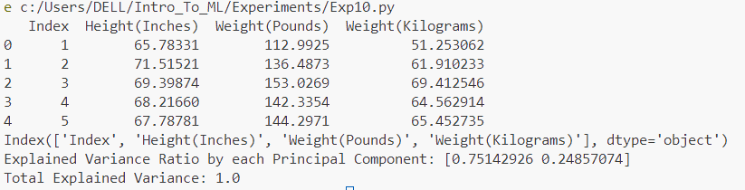
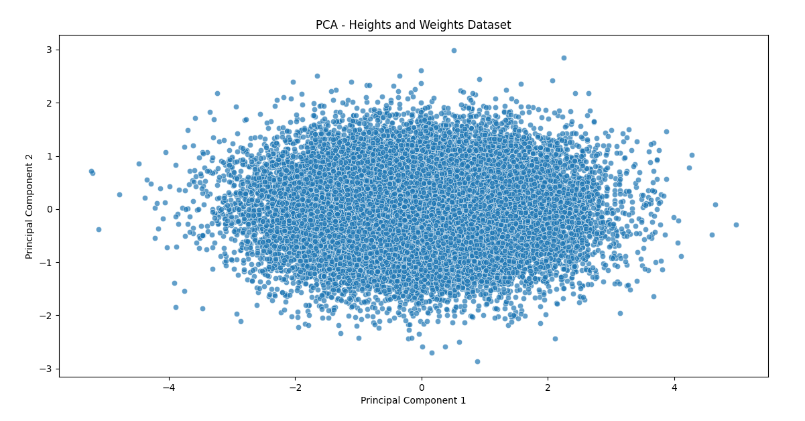

# Implementation of Principal Component Analysis (PCA) for Dimensionality Reduction on Energy Data

## AIM:
To implement Principal Component Analysis (PCA) to reduce the dimensionality of the energy data.

## Equipments Required:
1. Hardware – PCs
2. Anaconda – Python 3.7 Installation / Jupyter notebook

## Algorithm
1. Data Loading
2. Data Exploration
3. Data Preprocessing (Feature Scaling)
4. Applying PCA for Dimensionality Reduction
5. Explained Variance Analysis
6. Visualization of Principal Components

## Program:
```
/*
Program to implement Principal Component Analysis (PCA) for dimensionality reduction on the energy data.
Developed by: Vishwaraj G
RegisterNumber:  212223220125
*/
# Import necessary libraries
import pandas as pd
from sklearn.preprocessing import StandardScaler
from sklearn.decomposition import PCA
import matplotlib.pyplot as plt
import seaborn as sns

# Step 1: Data Loading from Local File
# Update the file path based on where you save the dataset
data = pd.read_csv('HeightsWeights.csv')

# Step 2: Data Exploration
# Display the first few rows and column names for verification
print(data.head())
print(data.columns)

# Step 3: Data Preprocessing (Feature Scaling)
# Correct column names
X = data[['Height(Inches)', 'Weight(Pounds)']]  # Use the correct column names

# Standardize the features
scaler = StandardScaler()
X_scaled = scaler.fit_transform(X)

# Step 4: Applying PCA for Dimensionality Reduction
# Initialize PCA to reduce to 2 components (since we have 2 features, this is a simple dimensionality reduction example)
pca = PCA(n_components=2)
X_pca = pca.fit_transform(X_scaled)

# Step 5: Explained Variance Analysis
# Print explained variance ratio to understand how much variance is captured by each principal component
explained_variance = pca.explained_variance_ratio_
print("Explained Variance Ratio by each Principal Component:", explained_variance)
print("Total Explained Variance:", sum(explained_variance))

# Step 6: Visualization of Principal Components
# Create a DataFrame for the principal components
pca_df = pd.DataFrame(X_pca, columns=['PC1', 'PC2'])

# Plot the first two principal components
plt.figure(figsize=(8, 6))
sns.scatterplot(x='PC1', y='PC2', data=pca_df, alpha=0.7)
plt.xlabel("Principal Component 1")
plt.ylabel("Principal Component 2")
plt.title("PCA - Heights and Weights Dataset")
plt.show()

```

## Output:


## Result:
Thus, Principal Component Analysis (PCA) was successfully implemented to reduce the dimensionality of the energy dataset.
